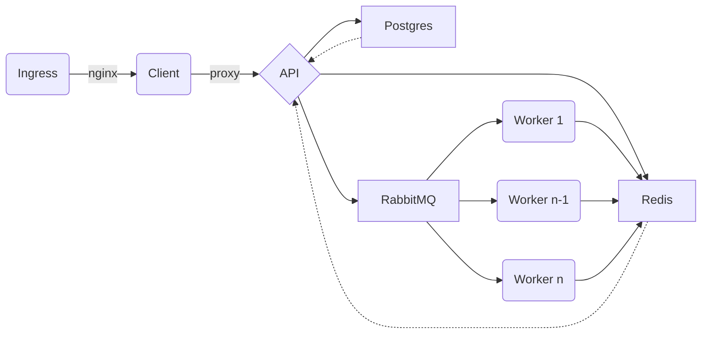

# Taktzeit

Simple playground to PoC scalable cloud patterns

## System Architecture

```mermaid
graph LR
A(Ingress)  -->|nginx| B(Client)
B -->|proxy| C{API}
C --> G
G[Redis] -.-> C
C --> I[Postgres]
I -.-> C
C --> H[RabbitMQ]
H -->D(Worker 1)
D --> G
H -->E(Worker n-1)
E --> G
H -->F(Worker n)
F --> G
```
